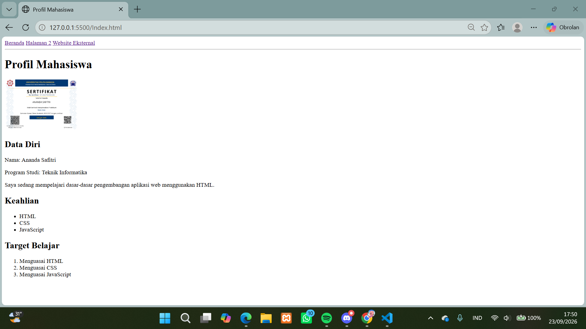
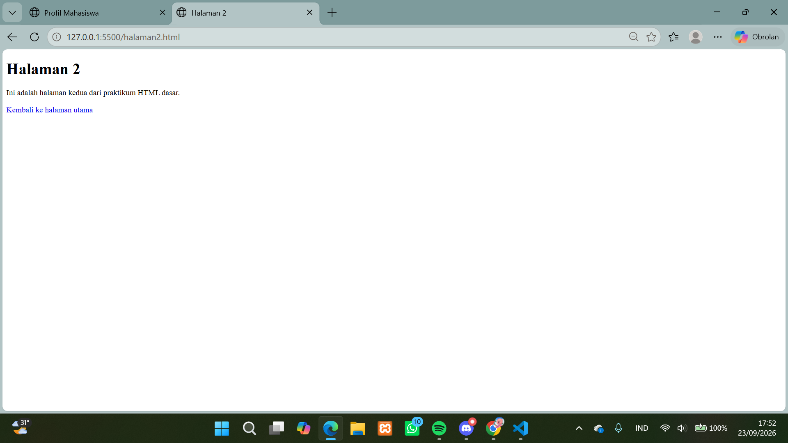

# Lab1Web

## Praktikum 1 HTML Dasar

Praktikum ini dilakukan untuk mempelajari dasar-dasar HTML dan cara membuat halaman web sederhana menggunakan Visual Studio Code.

## Tujuan Praktikum

Praktikum ini bertujuan untuk memahami struktur dasar HTML, penggunaan heading, paragraf, format teks, gambar, hyperlink, list, dan komentar HTML.

## Materi yang Dipelajari

- Struktur dasar HTML
- Heading
- Paragraf
- Format teks
- Gambar
- Hyperlink
- Unordered List
- Ordered List
- Komentar HTML

## Struktur Folder

```text
Lab1Web/
├── index.html
├── halaman2.html
├── images/
│   └── AnandaSaafitri-certificate.png
└── README.md
```

## Hasil Praktikum

### 1. Halaman Utama

Halaman utama dibuat menggunakan `index.html` dan berisi profil mahasiswa, data diri, foto, keahlian, serta target belajar.



### 2. Halaman 2

Halaman kedua dibuat menggunakan `halaman2.html` dan dilengkapi dengan link untuk kembali ke halaman utama.



## Fitur yang Dibuat

1. Halaman utama menggunakan `index.html`.
2. Halaman kedua menggunakan `halaman2.html`.
3. Menampilkan gambar dari folder `images`.
4. Membuat navigasi antarhalaman.
5. Membuat link ke website eksternal.
6. Menampilkan daftar keahlian menggunakan unordered list.
7. Menampilkan target belajar menggunakan ordered list.
8. Menggunakan komentar HTML untuk memberikan keterangan pada kode.

## Kesimpulan

Dari praktikum ini, saya mempelajari cara membuat struktur halaman web sederhana menggunakan HTML. Saya juga memahami penggunaan beberapa tag HTML seperti heading, paragraf, gambar, hyperlink, unordered list, ordered list, dan komentar HTML.